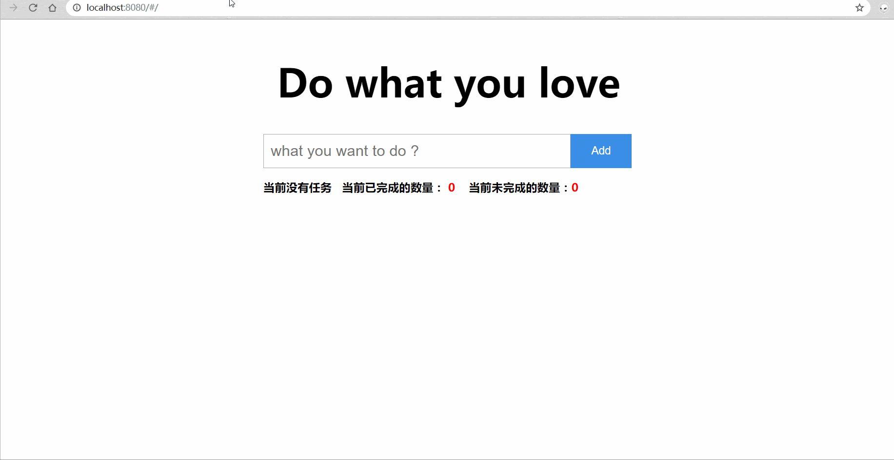

# todolist

> A Vue.js project

## Build Setup
## 第一个github小demo，之前还搞不懂.md文件怎么去写，现在把readme.md文件完善一下，方便大家直接看到todolist的效果



可直接选择git clone 或者download下载，cmd命令进入项目根目录下，`npm install `或者`cnpm install ` -----> `cnpm run dev` 然后在本地服务器8080端口打开即可。
（这里默认您已经拥有相关的Node npm包管理工具）,具体相关的代码逻辑可以移步到[我的CSDN](https://mp.csdn.net/postedit/88718949)。样式是自己用纯css写的，有点丑，不喜勿喷。
``` bash
# install dependencies
npm install

# serve with hot reload at localhost:8080
npm run dev

# build for production with minification
npm run build

# build for production and view the bundle analyzer report
npm run build --report

# run unit tests
npm run unit

# run e2e tests
npm run e2e

# run all tests
npm test
```

For a detailed explanation on how things work, check out the [guide](http://vuejs-templates.github.io/webpack/) and [docs for vue-loader](http://vuejs.github.io/vue-loader).
